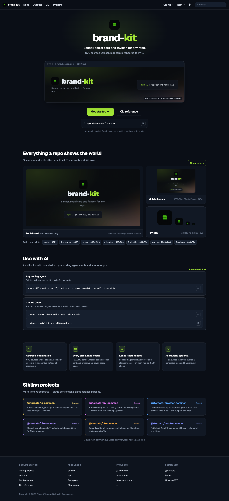
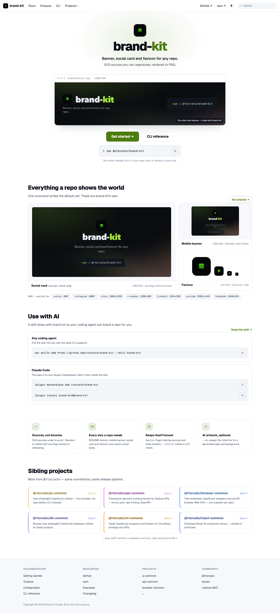

# DESIGN.md

The design spec for the brand-kit docs site (`apps/docs`). Read it before changing the site's UI, and keep the UI in step with it. If the UI needs to change, update this file and the mockups in the same PR.

- **Status:** v1, approved by rtorcato on 2026-10-10. UI PRs can build against it.
- **Designer:** Zoey (2026-10-10)
- **Mockups:** [`docs/design/`](docs/design/)
- **Clickable reference:** open `docs/design/mockup.html?theme=dark|light` locally in a browser. It loads the real assets from `brand/`. It's reference only, so don't ship it.

## Principle

brand-kit makes the images a repo shows the world, so the site shows **its own output first**. Every image on the landing page comes from this repo's `brand/` folder, made by brand-kit. If the brand changes, the site changes with it, with no separate artwork to keep in sync.

The site is a family docs site. It uses the same Docusaurus v3 structure, shared-docs theme and shared components as js-common and browser-common, and it changes only the accent colour.

## Mockups

| View | Dark | Light |
|---|---|---|
| Landing |  |  |

## Landing page (`src/pages/index.tsx`)

From top to bottom:

1. **Navbar** (Infima). The logo is `brand/favicon.svg` (copied to `static/img/`), followed by the title "brand-kit". Items: Docs, Outputs, CLI, then the shared Projects dropdown. On the right: GitHub ↗, npm ↗, the theme toggle and search.
2. **Hero** (centred, on a radial `--jt-accent-soft` glow):
   - The mark: `favicon-512.png` at 64px, radius 16px.
   - The wordmark as the `h1`: "brand-" in `--jt-heading` and "kit" in `--jt-accent`, Geist 800, 64px (40px on phones), letter-spacing −0.04em.
   - The tagline "Banner, social card and favicon for any repo." (19px, heading colour), then "SVG sources you can regenerate, rendered to PNG." (16px, muted).
   - **Preview frame:** `brand/banner.png` in a window frame (max width 880px, radius 16px, `--jt-border2`, shadow). The title bar reads `brand/banner.png · 1280×320` in mono. A bottom-right caption reads "this site's own banner — made with brand-kit". Alt text: "The brand-kit README banner, generated by brand-kit".
   - **Actions:** a primary "Get started →" button (`/docs`) and a secondary outline "CLI reference" button (`/docs/cli`). Below them, the shared `CommandBlock` with `npx @rtorcato/brand-kit`, then a faint hint: "No install needed. Run it in any repo, with or without a docs site."
3. **"Everything a repo shows the world"** with the sub-line "One command writes the default set. These are brand-kit's own." and an "All outputs →" link (`/docs/outputs`) on the right.
   - A gallery grid of 2fr and 1fr columns. The social card spans both rows on the left. The mobile banner and the favicon stack on the right. On phones it becomes one column.
   - Each tile shows the image on `--jt-bg2`, then a meta row with the name (plus the filename in mono where it helps) and the size and use, e.g. "1280×640 · og:image, GitHub preview".
   - The favicon tile shows `favicon-512.png` at 96, 48, 24 and 16px side by side.
   - Below the grid, mono chips for the `--social` sizes: avatar 400², instagram 1080², story 1080×1920, x-header 1500×500, linkedin 1584×396, youtube 2560×1440, facebook 1640×624.
4. **Use with AI:** the shared `UseWithAI` component with the brand-kit skill (`npx skills add https://github.com/rtorcato/brand-kit --skill brand-kit`) and the Claude Code plugin (`/plugin marketplace add rtorcato/brand-kit`, then `/plugin install brand-kit@brand-kit`).
5. **Pillars:** four cards in a row (2×2 on tablets, one column on phones), each with a lucide-style icon in a 36px accent-soft tile.
   - **Sources, not binaries** (code icon): SVG sources under `brand/`. Recolour or retitle with one flag instead of redrawing.
   - **Every size a repo needs** (panel icon): README banner, mobile banner, social card and favicon, plus seven social sizes.
   - **Keeps itself honest** (shield-check icon): `doctor` flags missing sources and stale renders, and `--strict` makes it a CI check.
   - **AI artwork, optional** (sparkle icon): `--ai` swaps the initial tile for a generated logo and background.
6. **Sibling projects:** the shared `<Siblings self="@rtorcato/brand-kit" />`, restyled in shared-docs (see below).
7. **Footer:** four columns (Documentation, Resources, Projects, Community), like the other family sites.

## Components

Use what already exists and add nothing new to shared-docs for this page:

| Section | Component |
|---|---|
| Install command | `@rtorcato/shared-docs/components/CommandBlock` |
| Use with AI | `@rtorcato/shared-docs/components/UseWithAI` |
| Sibling cards | `@rtorcato/shared-docs/components/Siblings` |
| Buttons | Infima `button button--primary button--lg` and `button button--secondary button--outline button--lg` |
| Hero, gallery, pillars | Local markup and `index.module.css`, using `--jt-*` tokens only |

## Tokens

The shared-docs `theme-tokens.css` and `theme.css` provide everything. The site sets only the accent in `src/css/custom.css`:

| Token | Light | Dark |
|---|---|---|
| `--ifm-color-primary`, `--jt-accent` | `#4d7c0f` (lime-700) | `#a3e635` (lime-400) |
| Text on accent (primary button) | `#fff` | `#0a0e16` |

**Why light mode differs:** lime-400 on white is about 1.4:1, so the button text, the active sidebar item and the breadcrumb all fail WCAG AA. Lime-700 on white is about 5:1. Dark mode keeps lime-400, which is about 13:1 on `#0a0e16`.

## Type

Geist for everything and Geist Mono for code, filenames, sizes and chips, as shipped by shared-docs.

| Use | Size / weight |
|---|---|
| Wordmark | 64px / 800 (40px on phones) |
| Section heading | 30px / 800, letter-spacing −0.02em |
| Tagline | 19px / 500 |
| Body, sub-lines | 16px / 400 |
| Card titles | 15px / 700 |
| Card body, meta | 13px / 400 |
| Chips | Geist Mono 12px |

## shared-docs changes

These go in rtorcato/shared-docs, so every family site gets them:

- **`<Siblings>` restyle:** draw the cards with `--jt-surface`, `--jt-border` and a 3px left border in each project's family accent, matching browser-common's sibling cards. In light mode, darken the title tint (`color-mix(in srgb, <accent> 62%, #000)`) so it passes AA. Today the cards use Infima's grey `--ifm-card-background-color` with no stripe.
- **Version:** brand-kit pins `^1.13.1`. Bump it to `^1.15.0`, which fixes brand-kit's sibling card label and drops repo-ai from the family list.

## Rules

- Every image on the landing page comes from `brand/`. Don't add separate marketing artwork.
- Copy the `brand/` files the site uses into `apps/docs/static/img/` (or import them), and regenerate them with brand-kit rather than editing the PNGs.
- Override only the accent. Any other token change goes in shared-docs.
- Accessibility: WCAG 2.1 AA contrast in both themes, a visible focus ring on every link and button, buttons at least 44px tall, and real alt text on the preview and gallery images (the favicon size row is decorative, so use `alt=""`).

## Brand

The repo's own assets live in `brand/`, made with `npx @rtorcato/brand-kit` (AI logo and background from #68).

| Asset | File | Size |
|---|---|---|
| README banner | `brand/banner.png` (`banner.svg`) | 1280×320 |
| Mobile banner | `brand/banner-mobile.png` (`banner-mobile.svg`) | 1280×786 |
| Social card | `brand/social-card.png` (`social-card.svg`) | 1280×640 |
| Favicon | `brand/favicon.svg`, `favicon-512.png`, `favicon.ico` | SVG, 512, 16+32 |
| Logo | `brand/logo.png` | AI-generated |
| Background | `brand/background.png` | AI-generated |
