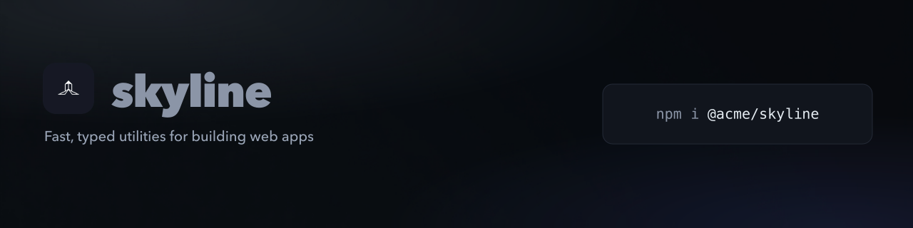

<!-- brand-kit:banner:start -->
<picture>
  <source media="(max-width: 640px)" srcset="./brand/banner-mobile.png">
  
</picture>
<!-- brand-kit:banner:end -->

# ai-cloudflare

Logo and canvas background generated by Cloudflare Workers AI with `--ai`.
Everything else is the same as [basic](../basic): name and tagline from
`package.json`.

The project is called `skyline`, not `ai-cloudflare`. The name goes into the
logo prompt, and with a company's name there the model draws that company's
logo.

```sh
cp .env.example .env    # then fill in CLOUDFLARE_ACCOUNT_ID + CLOUDFLARE_API_TOKEN
npx @rtorcato/brand-kit --ai --ai-provider cloudflare --ai-prompt "flat geometric line art"
```

- **Provider:** `cloudflare`, default model `@cf/black-forest-labs/flux-1-schnell`. Override with `--ai-model`.
- **Get a key:** [Cloudflare API tokens](https://dash.cloudflare.com/profile/api-tokens) — create one from the **Workers AI** template. A deploy-only token is refused with a 403.
- **Key:** `CLOUDFLARE_ACCOUNT_ID` + `CLOUDFLARE_API_TOKEN`, read from this folder's `.env` (gitignored) or the shell.
- **Pass `--ai-provider cloudflare`:** Cloudflare is last in the auto-pick order, because `CLOUDFLARE_API_TOKEN` is often a deploy token without AI access.
- **Cost:** FLUX.1 schnell is a fraction of a cent per image, and Workers AI's free daily allowance covers a typical run.
- **Style:** `--ai-prompt` is the same in every `ai-*` example, so they differ only by provider.

It saves the art as sources in [`brand/`](brand): `logo.png`,
`background.png`, and a `favicon.svg` that embeds the logo. Re-renders need
no key; run `--ai` again only for new art.

## Local test run

`test-brand/` is gitignored. It stands in for a real repo (repo-ai's name and
description) so you can try the provider without committing the output:

```sh
cp .env test-brand/.env
node ../../dist/cli.js --dir test-brand --ai --ai-provider cloudflare --ai-prompt "flat geometric line art"
```
