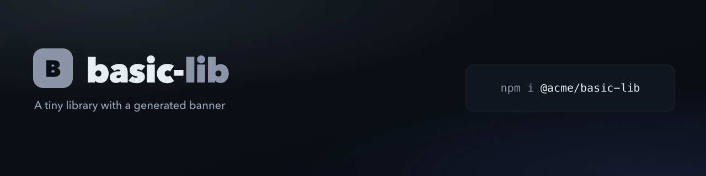

<!-- js-tooling:banner:start -->
<picture>
  <source media="(max-width: 640px)" srcset="./brand/banner-mobile.png">
  
</picture>
<!-- js-tooling:banner:end -->

# basic

The zero-flag run. A `package.json` with a `name` and `description` is all it
needs.

```sh
npx @rtorcato/brand-kit
```

- **Name:** `basic-lib`, from `package.json` without the scope.
- **Tagline:** the `package.json` `description`.
- **Accent:** neutral grey, since nothing else supplies one.

It wrote the SVG sources and `render.sh` into [`brand/`](brand), rendered the
PNGs, and added the banner block above this heading.

Keep it current in CI:

```sh
npx @rtorcato/brand-kit doctor --strict   # exit 1 on missing sources, stale PNGs or no banner
```
