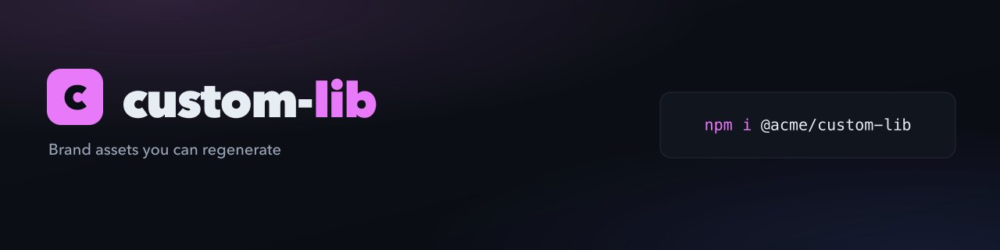

<!-- js-tooling:banner:start -->
<picture>
  <source media="(max-width: 640px)" srcset="./brand/banner-mobile.png">
  
</picture>
<!-- js-tooling:banner:end -->

# custom

Tagline and accent from flags. Both beat `package.json` and every other source.

```sh
npx @rtorcato/brand-kit --tagline "Brand assets you can regenerate" --accent "#e879f9"
```

To change them later, rerun with the new values and `--update`, which rewrites
the sources that differ (never `brand/favicon.svg`) and re-renders:

```sh
npx @rtorcato/brand-kit --tagline "New line" --update
```
