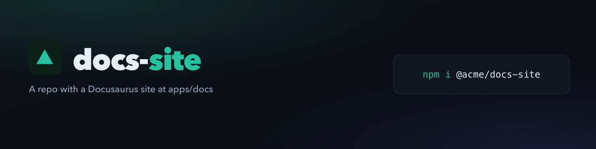

<!-- js-tooling:banner:start -->
<picture>
  <source media="(max-width: 640px)" srcset="./brand/banner-mobile.png">
  
</picture>
<!-- js-tooling:banner:end -->

# docusaurus

A repo with a Docusaurus site at `apps/docs`. No flags: the site supplies the
brand.

```sh
npx @rtorcato/brand-kit
```

- **Accent:** `#25c2a0`, the dark-theme `--ifm-color-primary` in
  [`apps/docs/src/css/custom.css`](apps/docs/src/css/custom.css).
- **Logo:** the site's existing
  [`apps/docs/static/img/favicon.svg`](apps/docs/static/img/favicon.svg),
  kept as `brand/favicon.svg` instead of a generated initial.
- **Copies:** `favicon.ico` and `social-card.png` were written back into
  `apps/docs/static/img/` for the site to serve.
