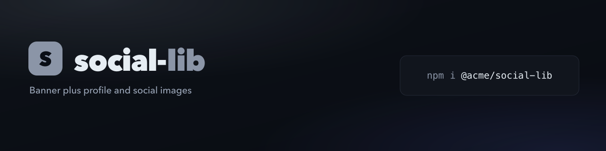

<!-- js-tooling:banner:start -->
<picture>
  <source media="(max-width: 640px)" srcset="./brand/banner-mobile.png">
  
</picture>
<!-- js-tooling:banner:end -->

# social

The default set plus images you upload to profiles and posts.

```sh
npx @rtorcato/brand-kit --social
```

| File | Size |
|---|---|
| [`avatar.png`](brand/avatar.png) | 400×400 |
| [`instagram-post.png`](brand/instagram-post.png) | 1080×1080 |
| [`story.png`](brand/story.png) | 1080×1920 |
| [`x-header.png`](brand/x-header.png) | 1500×500 |
| [`linkedin-banner.png`](brand/linkedin-banner.png) | 1584×396 |
| [`youtube-banner.png`](brand/youtube-banner.png) | 2560×1440 |
| [`facebook-cover.png`](brand/facebook-cover.png) | 1640×624 |

The flag is needed once. After that, `render`, `render.sh`, `doctor` and
`--update` keep these current on their own.
